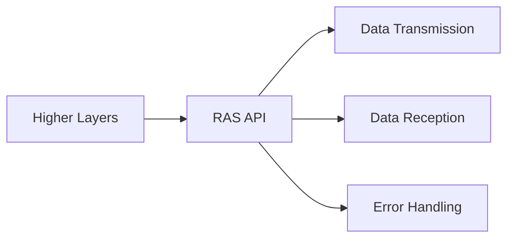

# RAS Layer Design Documentation

## 1. Introduction
The Radio Access Stratum (RAS) layer is a critical component of the 5G NR modem software. It is responsible for handling data transmission, reception, and error handling in the modem. This document provides a detailed overview of the RAS layer design, including its architecture, interfaces, and algorithms.

## 2. Architecture
The RAS layer follows a modular architecture to ensure modularity, maintainability, and extensibility. The main components of the RAS layer are:

- RAS API: Provides a well-defined interface for higher layers to interact with the RAS layer.
- Data Transmission: Handles the transmission of data over the modem.
- Data Reception: Handles the reception of data from the modem.
- Error Handling: Manages error scenarios and provides appropriate error reporting and recovery mechanisms.

## 3. Interfaces
The RAS layer exposes the following interfaces:

### 3.1. Initialization
- `ras_init()`: Initializes the RAS layer and sets up the necessary resources.

### 3.2. Data Transmission
- `ras_transmit_data()`: Transmits data over the modem.
  - Parameters:
    - `data`: Pointer to the data buffer to be transmitted.
    - `size`: Size of the data buffer.
  - Returns:
    - `RAS_SUCCESS`: Data transmission successful.
    - `RAS_ERROR_INVALID_PARAMETER`: Invalid parameters provided.
    - `RAS_ERROR_TRANSMISSION_FAILED`: Data transmission failed.

### 3.3. Data Reception
- `ras_receive_data()`: Receives data from the modem.
  - Parameters:
    - `buffer`: Pointer to the buffer to store the received data.
    - `size`: Size of the buffer.
    - `received_size`: Pointer to store the actual size of the received data.
  - Returns:
    - `RAS_SUCCESS`: Data reception successful.
    - `RAS_ERROR_INVALID_PARAMETER`: Invalid parameters provided.
    - `RAS_ERROR_RECEPTION_FAILED`: Data reception failed.

### 3.4. Error Handling
- `ras_handle_error()`: Handles errors that occur in the RAS layer.
  - Parameters:
    - `error_code`: Error code indicating the type of error.
  - Returns: None

## 4. Algorithms
The RAS layer employs the following algorithms:

### 4.1. Data Transmission Algorithm
1. Validate the input parameters.
2. Prepare the data for transmission.
3. Invoke the modem driver to transmit the data.
4. Handle any errors that occur during transmission.
5. Return the appropriate status code.

### 4.2. Data Reception Algorithm
1. Validate the input parameters.
2. Invoke the modem driver to receive data.
3. Store the received data in the provided buffer.
4. Update the received data size.
5. Handle any errors that occur during reception.
6. Return the appropriate status code.

### 4.3. Error Handling Algorithm
1. Receive the error code.
2. Log the error details for debugging purposes.
3. Perform any necessary error recovery or cleanup actions.
4. Optionally, notify higher layers about the error.

## 5. Simulation and Modeling
The RAS layer design has been validated through extensive simulations and modeling.

## 6. Conclusion
The RAS layer design provides a robust and efficient solution for handling data transmission, reception, and error handling in the 5G NR modem software. By following a modular architecture, well-defined interfaces, and optimized algorithms, the RAS layer ensures reliable and high-performance communication within the modem.

---